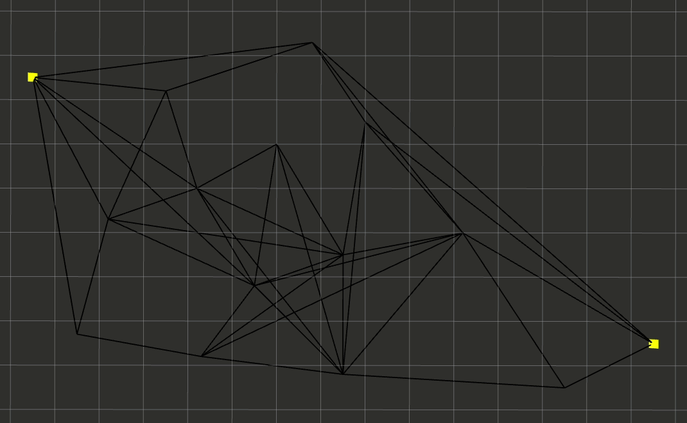

# pathviz

This project aims to serve as a growing hub for concrete implementations and intuitive visualizations of classic algorithms related to path planning. 

The algorithms implemented here have been covered thoroughly in literature, as well as in various motion / path planning courses whose material is freely available online. In particular, ***Principles of Robot Motion (Choset, et al)*** and ***Computational Geometry (de Berg, et al)*** served as my primary reference texts.

*pathviz* is not intended to be a standalone reference; instead it focuses on providing a visual supplement to well-known algorithms. At most, each algorithm will come with a brief snippet of pseudocode to remind readers of what it does. Complete information can be found in the aforementioned books.

## Dependencies

- ROS Melodic
- rviz
- [graphlib](https://github.com/tedklin/back-to-basics/tree/master/algorithms/graphlib) (A separate library I wrote for more general fundamental graph theory)

ROS launch files that run the visualizations automatically are included.

## Lee's rotational plane sweep algorithm

*for visibility graph construction*

### Pseudocode

(from *Principles of Robot Motion*)

### Animation

*Side notes:*
- *The implementation here sweeps counterclockwise starting at the negative x-axis w.r.t. the current source vertex.*
- *This animation clocks in at over 10 minutes, so you might want to refresh the page to watch the beginning. Also, if you don't have a particularly intense desire to see the animation all the way through, scroll down to see the complete visiblity graph.*

| Color | Component |
| --- | --- |
| blue | static obstacle polygons |
| yellow | static start and goal points |
| purple | current source vertex |
| orange | rotational sweep line visiting all other vertices |
| green | successful line of visibility |
| black | unsuccessful line of visibility|
| red | active list of edges |

### Result

## Dijkstra's algorithm and its heuristic variation A*

*for shortest paths in a positive-edge-weighted graph*

### Pseudocode

(from *Principles of Robot Motion*)

### Animation

| Color | Component |
| --- | --- |
| black | static Euclidean graph |
| yellow | static start and goal points |
| green | current vertex being expanded / relaxed |
| blue points | relaxed vertices |
| blue lines | currently-known best path from start point to a relaxed vertex (relaxed edges) |
| orange | priority queue of vertices to relax next (fringe) |

#### Dijkstra's algorithm

#### A* search algorithm

